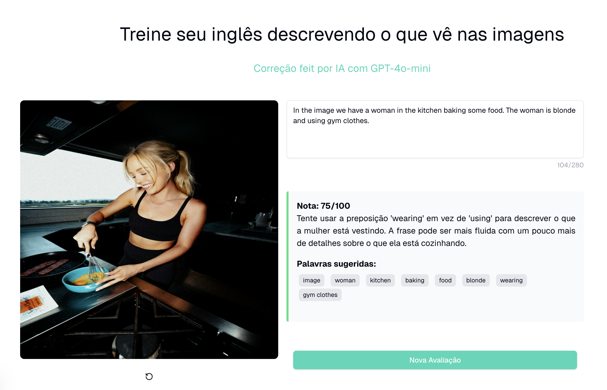

# Image describer AI



## Deployed project

[Image describer AI](https://image-describer-ai.vercel.app/)

## Description

This project was created for people who want to learn and practice English.  
The idea is to take a random image from Unsplash, describe its content, and use ChatGPT to analyze the description, providing a score and suggesting words that can be replaced.

It's similar to what we have in the Duolingo English proficiency test.

## Run the project

To run the project locally, you need to create a .env file and add API keys for **Unsplash** and **ChatGPT**.

It should look like this:

```env
  NEXT_PUBLIC_UNSPLASH_ACCESS_KEY=unsplash_api_key
  NEXT_PUBLIC_GPT_ACCESS_KEY=gpt_api_key
```

Install the dependencies:

```bash
npm i
```

Run the project

```bash
npm run dev
```
